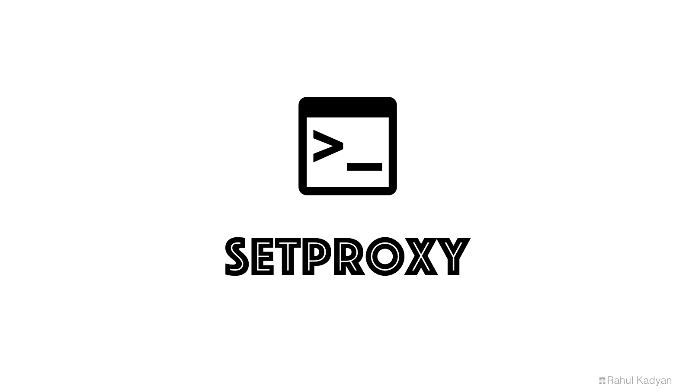

# SetProxy

Painless proxy configuration.



<p align="center">
  <a href="LICENSE">
    
  </a>
  <a href="https://github.com/znck/downloader/releases">
    
  </a>

  <a href="https://github.com/znck/downloader/issues">
    
  </a>
</p>

## Installation

Run this in your terminal to get the latest SetProxy version:
```bash
# Using curl.
curl -sS https://raw.githubusercontent.com/znck/setproxy/v0.0.1/install.sh | sudo -E bash
# Using wget.
wget -O - -o /dev/null https://raw.githubusercontent.com/znck/setproxy/v0.0.1/install.sh | sudo -E bash
```

## Usage

SetProxy command line interface.

```bash
setproxy -h
```
> TODO: Update usage docs.

## Change log

Please see [CHANGELOG](CHANGELOG.md) for more information what has changed recently.

## Testing

> Accepting PR :p

## Contributing

Please see [CONTRIBUTING](CONTRIBUTING.md) and [CONDUCT](CONDUCT.md) for details.

## Security

If you discover any security related issues, please email :author_email instead of using the issue tracker.

## Credits

- [Rahul Kadyan][link-author]
- [All Contributors][link-contributors]

## License

The MIT License (MIT). Please see [License File](LICENSE) for more information.

[link-author]: http://znck.me
[link-contributors]: ../../contributors
